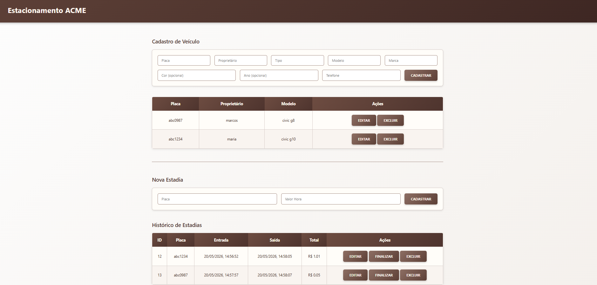
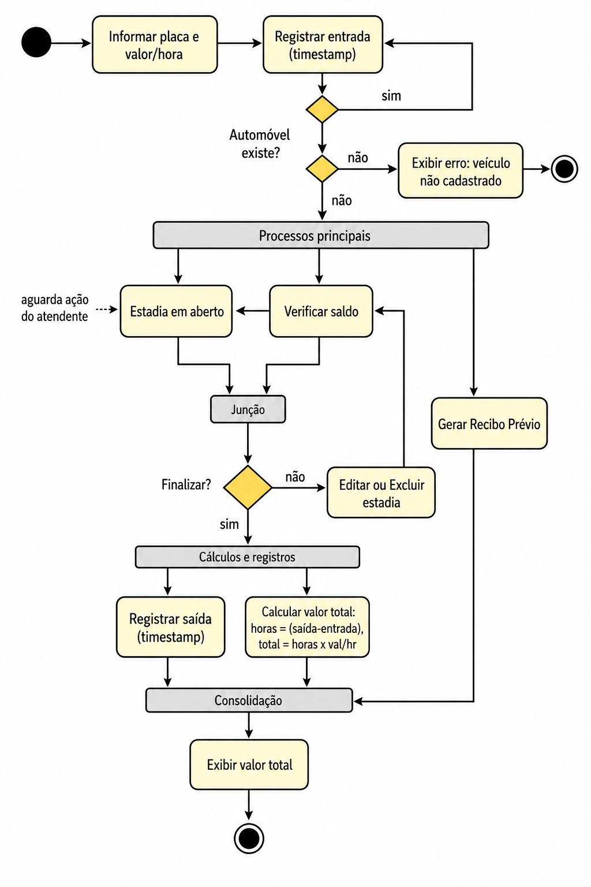
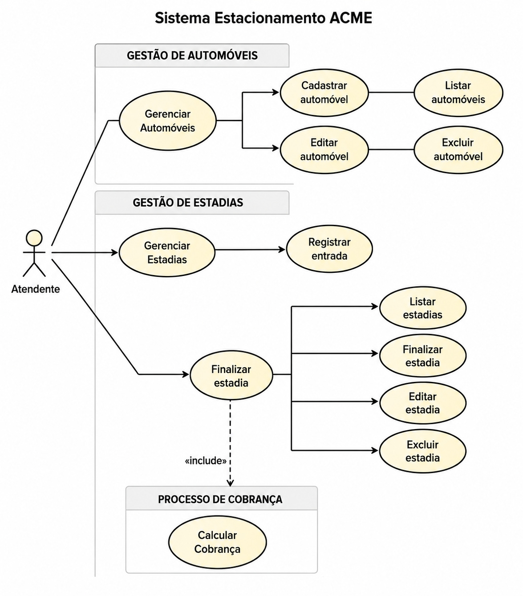

# ESTACIONAMENTO ACME WEB
Situação de Aprendizagem - Full-stack (Node.JS, JavaSript, VsCode, ORM Prisma, Insomnia)

# Visual do site UML


# Documentação UML
Parte visual da arquiquetura

# Diagrama de Atividades (da)


# Diagrama de Casos de Uso (dcu)


# Diagrama de Classes (dc)


# Passo a passo
- Clone e instale este repositório
```bash
git clone https://github.com/MoniqueBabler/Atividade-Fork_Estacionamento.git
```


- Crie um arquivo `.env` na raiz do projeto:

```env
PORT=3000
DATABASE_URL="mysql://root@localhost:3306/mydb"
```

- Executar as migrations do banco de dados

```bash
npx prisma migrate dev
```

- Iniciar o servidor

```bash
npm run dev
```

O servidor estará disponível em `http://localhost:3000`.

## Abrir o frontend

Abra o arquivo `index.html` diretamente no navegador,  
ou utilize uma extensão como o **Live Server** no VS Code.

# Como Utilizar o Sistema

### Cadastro de Veículos
1. Abra o arquivo `index.html` no navegador.
2. Preencha os dados do veículo:
   - Placa
   - Proprietário
   - Tipo
   - Modelo
   - Marca
   - Telefone
3. Clique em **Cadastrar Veículo**.

### Registro de Estadia
1. Informe a placa de um veículo já cadastrado.
2. Digite o valor cobrado por hora.
3. Clique em **Registrar Estadia**.

### Finalizar Estadia
1. Localize a estadia ativa na tabela.
2. Clique no botão **Finalizar**.
3. O sistema calculará automaticamente o valor total da permanência.

### Gerenciamento de Registros
- Utilize os botões da tabela para:
  - Editar informações
  - Excluir registros